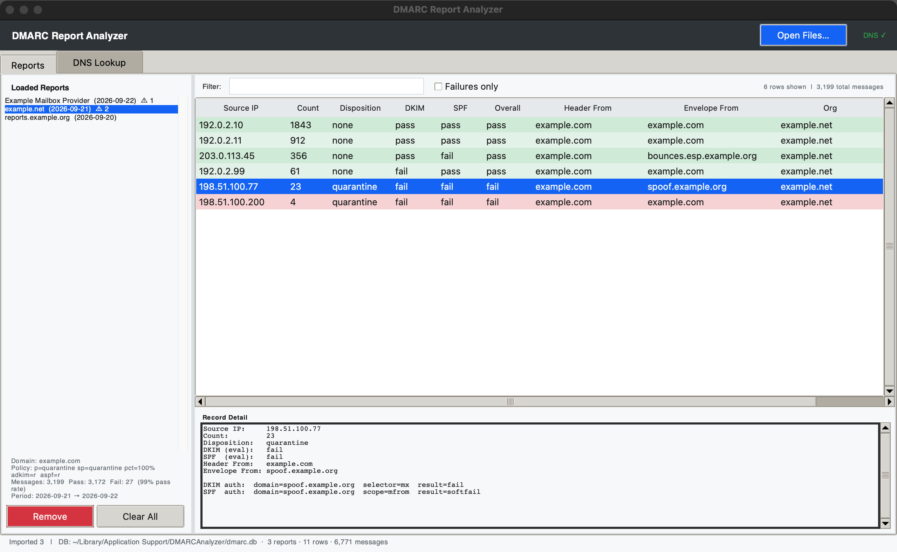
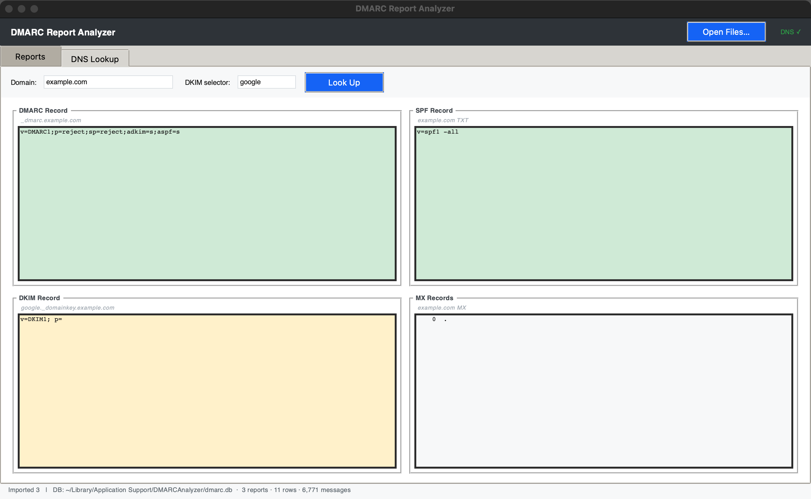

# DMARC Analyzer

A local macOS desktop app for reading DMARC aggregate reports (RFC 7489).
Drag in the `.xml`, `.xml.gz` or `.zip` attachments that mailbox providers
send to your `rua=` address, see every source IP with pass/fail
highlighting, and look up live DMARC/SPF/DKIM/MX records for any domain.

Everything runs on your machine. No accounts, no telemetry, no uploads —
the only network traffic is the DNS queries you trigger yourself. Imported
reports persist in a local SQLite database
(`~/Library/Application Support/DMARCAnalyzer/dmarc.db`).





<sub>Screenshots use synthetic reports: reserved `example.*` domains and
documentation IP ranges.</sub>

## Features

- Parses RFC 7489 aggregate reports — the XML format mailbox providers such
  as Google and Microsoft send — whether it arrives as `.xml`, `.xml.gz` or
  `.zip`
- Per-source-IP table: disposition, DKIM/SPF evaluation, alignment result,
  header-from vs envelope-from, sortable and filterable, failures-only toggle
- Record detail view showing every DKIM selector and SPF scope the reporter
  evaluated
- Live DNS tab: DMARC, SPF, DKIM (by selector), and MX lookups in one shot
- SQLite persistence with duplicate-report detection — re-importing files
  you already loaded is a no-op
- Treats report files as untrusted: anyone can mail your `rua=` address, so
  reports over 25 MB uncompressed are refused, DTDs/entities are never
  processed, and zips are read in memory, never extracted
- Drag and drop onto the window or the Dock icon; Finder "Open With" works
  for `.xml`, `.gz` and `.zip`

## Install

Clone the repo, then either build the standalone app or run it straight from
source. Both need Python 3.10+ **with tkinter** — the python.org installer
includes it (Homebrew users: `brew install python-tk`). The Python 3.9 that
ships with macOS is too old.

```bash
git clone https://github.com/goetchstone/dmarc-analyzer.git
cd dmarc-analyzer
```

### Build the app (recommended)

Produces a self-contained `DMARC Analyzer.app` that bundles its own Python
runtime, dnspython, and tkinterdnd2 — the finished bundle needs nothing
installed to run. Because it's built locally, it carries no quarantine flag,
so there's no Gatekeeper "Open Anyway" prompt.

```bash
./build_app.sh            # builds dist/DMARC Analyzer.app
./build_app.sh --install  # also copies it to /Applications
```

The script creates a throwaway `build_venv`, so it won't touch your system
Python. A build usually takes under a minute.

### Run from source

To run it directly without building a bundle, use a virtual environment
(Homebrew's Python refuses a global `pip3 install`):

```bash
python3 -m venv .venv
.venv/bin/pip install dnspython tkinterdnd2
.venv/bin/python dmarc_analyzer.py
```

`tkinterdnd2` is optional — it only adds native Finder drag-and-drop; the app
runs without it.

## Reading your results

| Pattern | Meaning |
|---|---|
| DKIM pass, SPF fail, overall pass | Normal for bulk senders (ESPs) relying on DKIM alignment; the envelope-from is the ESP's domain. Fine as long as DKIM passes. |
| DKIM fail, SPF pass, overall pass | SPF alignment carried it. Check why DKIM is failing for that source. |
| DKIM fail, SPF fail, overall fail | DMARC failure. Either a legitimate sender you haven't authorized, or someone spoofing your domain. The source IP tells you which. |
| Disposition quarantine/reject | The receiver enforced your published policy on that mail. |
| Disposition none despite failure | The receiver overrode policy (common with `p=none`, `pct<100`, or forwarders). |

A synthetic sample report you can try immediately is at
`tests/fixtures/sample_report.xml`.

## Tests

The core suite (parsing of every supported format, hostile-input handling,
SQLite persistence and DNS result colouring) runs headless with only the
standard library — no dependencies and no display needed:

```bash
python3 tests/test_core.py
```

## License

MIT — see [LICENSE](LICENSE).
